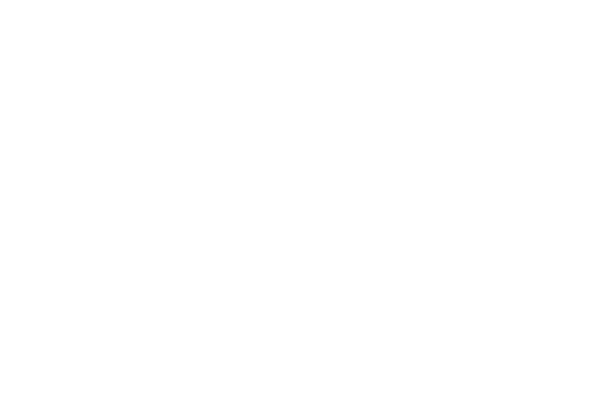

% Partial isomorphisms for error-free JSON round-trips

# The problem

## What are we trying to fix?
Writing isomorphic printer/parsers with the "get" and "put" idiom is messy and
error prone.

# The problem

## Get/put, look familiar?
```haskell
-- | Wire encoding and decoding with the possibility
--   of a decode failing.
class WireFormat a where
    fromWire :: ByteString -> Either SomeException a
    toWire   :: operation -> ByteString
```

# The problem

## Given a datatype:
```haskell
data ReadRequest
    = SimpleReadRequest   Address Time Time
    | ExtendedReadRequest Address Time Time
  deriving (Eq, Show)
```
# The problem

## Encoding (total)
```haskell

instance WireFormat ReadRequest where
    toWire (SimpleReadRequest addr start end) =
        packWithHeaderByte 0 addr start end
    toWire (ExtendedReadRequest addr start end) =
        packWithHeaderByte 1 addr start end

packWithHeaderByte :: Word8 -> Address -> Time -> Time
                   -> ByteString
packWithHeaderByte header addr start end =
    let addr_bytes = toWire addr
    in runPacking 25 $ do
        putWord8 header
        putBytes addr_bytes
        putWord64LE start
        putWord64LE end
```
# The problem

## Decoding (partial)
```haskell
fromWire bs
    | S.length bs /= 25 =
        Left . SomeException $ userError "/= 25 bytes"
    | otherwise = flip tryUnpacking bs $ do
        header <- getWord8
        addr_bytes <- getBytes 8
        addr <- either (fail . show) return $
            fromWire addr_bytes
        start <- getWord64LE
        end <- getWord64LE
        case header of
            0 -> return $
                    SimpleReadRequest addr start end
            1 -> return $
                    ExtendedReadRequest addr start end
            _ -> fail "invalid header byte"
```

# The problem

## So, we test it and hope for the best:

```haskell
suite :: Spec
suite = describe "WireFormat identity tests" $ do
    prop "ReadRequest" (wireId :: ReadRequest -> Bool)
    prop "ReadStream"  (wireId :: ReadStream -> Bool)

wireId :: (Eq w, WireFormat w) => w -> Bool
wireId op = id' op == op
  where
    id' = fromRight . fromWire . toWire
    fromRight = either (error . show) id
```

# Introducing: Enterprise JSON

. . .

## "datetime"
```json
"27/6/2013 10:29 pm"
```

. . .

## "date"

```json
"12/12/2012"
```

. . .

## "mmyydate"

```json
"12/2012"
```

OR

```json
"12.2012"
```

OR

```json
"122012"
```

. . .

## "mmdddate"

```json
"12/12"
```

# Introducing: Enterprise JSON


# Introducing: Enterprise JSON

## "checkbox"

```json
"T"

```
## "currency", "currency2" and "poscurrency"

```json
"00.03"
```

## "posfloat", "nonnegfloat"

```json
"2.718281828459045"
```

# Introducing: Enterprise JSON

## Oh hi! I just finished your JSON specification.


# Introducing: Enterprise JSON


# A wild paper appears!



# Invertible Syntax Descriptions: way of the get/put

## Given a datatype:
```haskell
data List a
  = Nil
  | Cons a (List a)
```

# Invertible Syntax Descriptions: way of the get/put

## Parsing
```haskell
parseMany :: Parser a → Parser (List a)
parseMany p
  =  const Nil <$> text ""
 <|> Cons      <$> p
               <*> parseMany p
```

. . .

## Printing
```haskell
printMany :: Printer a -> Printer (List a)
printMany p list
  = case list of
    Nil       -> text ""
    Cons x xs -> p x
              <> printMany p xs
```

# Invertible Syntax Descriptions: co/contravariance

## Parser
```haskell
newtype Parser a = Parser (String -> [(a, String)])

(<$>) :: (a -> b) -> Parser a -> Parser b
```

. . .

## Printer
```haskell
type Printer a = a -> Doc

(<$>) :: (b -> a) -> Printer a -> Printer b
```

# Invertible Syntax Descriptions: co/contravariance
## Partial isomorphism (academia decoded)
```haskell
data Iso a b = Iso
    { apply   :: a -> Maybe b
    , unapply :: b -> Maybe a
    }
```

# Invertible Syntax Descriptions: co/contravariance

## Partial isomorphisms for typists
```haskell
data Iso a b = Iso (a -> Maybe b) (b -> Maybe a)

inverse :: Iso a b -> Iso b a
inverse (Iso f g) = Iso g f

apply :: Iso a b -> a -> Maybe b
apply (Iso f g) = f

unapply :: Iso a b -> b -> Maybe a
unapply = apply . inverse

instance Category Iso where
    g . f = Iso (apply f   >=> apply g)
                (unapply g >=> unapply f )
    id = Iso Just Just
```

# Invertible Syntax Descriptions: co/contravariance

## Parser
```haskell
instance Functor Parser where
  (<$>) :: (a -> b) -> Parser a -> Parser b
```

## Printer
```haskell
instance Functor Printer where
  (<$>) :: (b -> a) -> Printer a -> Printer b
```
. . .

## Combined
```haskell
class IsoFunctor f where
  (<$>) :: Iso a b -> f a -> f b
```

# Invertible Syntax Descriptions: applicative

## Normal applicative

```haskell
(<*>) :: f (a -> b) -> f a -> f  b

instance Applicative Parser where
  (<*>) :: Parser (a -> b) -> Parser a -> Parser b
```

. . .

## Adapting that directly

```haskell
class UnhelpfulIsoApplicative where
  (<*>) :: f (Iso a b) -> f a -> f b
```

. . .

## Falls apart on Printer (the contravariant one)

```haskell
type Printer a = a -> Doc

instance Applicative Printer where
  (<*>) :: (Iso a b -> Doc) -> (a -> Doc) -> b -> Doc
  (f <*> g) b = error "impossible!"
```

# Invertible Syntax Descriptions: applicative

## Normal applicative
```haskell
class Functor f => Applicative f where
  (<*>) :: f (a -> b) -> f a -> f b
```

. . .

## *#!@ it, associate right and tuple it applicative

```haskell
class ProductFunctor f where
  infixr 6 <*>
  (<*>) :: f a -> f b -> f (a, b)
```

# Invertible Syntax Descriptions: applicative

## Normal (currying applicative, left associative)

```haskell
f :: Applicative f
  => (a -> b -> c -> d)
  -> f a -> f b -> f c -> f d
f g fa fb fc =    g <$> fa  <*> fb  <*> fc
f g fa fb fc = ((g <$> fa) <*> fb) <*> fc
```

## Our new, alternate universe

```haskell
f :: (ProductFunctor f, IsoFunctor f)
  => Iso (a, (b, c)) d
  -> f a -> f b -> f c -> f d
f g fa fb fc = g <$>   fa <*> fb  <*> fc
f g fa fb fc = g <$> ((fa <*> fb) <*> fc)
```

# Invertible Syntax Descriptions: applicative

## Given a datatype:
```haskell
data List a
  = Nil
  | Cons a (List a)

defineIsomorphisms ''List
```

## We magic up:
```haskell
nil  :: Iso ()          (List a)
cons :: Iso (a, List a) (List a)
```

# Invertible Syntax Descriptions: alternative

## The final piece is trivial
```haskell
class Alternative where
  (<|>) :: f a -> f a -> f a
```

## And we now have an abstract syntax!
```haskell

class (IsoFunctor s, ProductFunctor s, Alternative s)
       => Syntax s where
  pure :: Eq alpha => alpha -> delta alpha
```

# Invertible Syntax Descriptions: the punchline

## Parsing
```haskell
parseMany :: Parser a → Parser (List a)
parseMany p
  =  const Nil <$> text ""
 <|> Cons      <$> p
               <*> parseMany p
```

## Printing
```haskell
printMany :: (a -> Doc) -> (List a -> Doc)
printMany p list
  = case list of
    Nil       -> text ""
    Cons x xs -> p x
              <> printMany p xs
```

# Invertible Syntax Descriptions: the punchline

## Invertible many
```haskell
many :: Syntax s -> s a -> s [a]
many p
  =  nil  <$> pure ()
 <|> cons <$> p <*> many p
```
